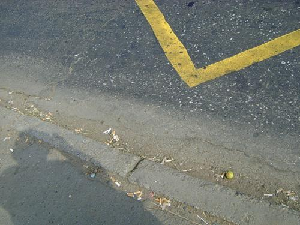
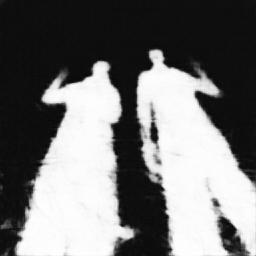

 
 
   

# A+D-Net: Shadow Detection with Adversarial Shadow Attenuation

This is a demo of [ADNet for shadow detection](https://arxiv.org/abs/1712.01361). The code is written by [Hieu Le](https://lmhieu612.github.io). A large amount of code is borrowed from the pix2pix implementation of Jan-Yan-Zhu and Teasung Park. 

To run the code, please download our pre-trained model at: https://drive.google.com/file/d/18ro6xdH4usRtw8XC_rVan_FCiKMDV7va/view?usp=sharing

If you use this code for your research, please cite:

A+D-Net: Shadow Detection with Adversarial Shadow Attenuation
Hieu Le, Tomas F. Yago Vicente, Vu Nguyen, Minh Hoai, Dimitris Samaras
In arxiv, 2017
